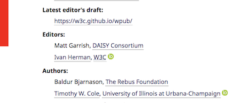

# This repository is now obsolete!

Adding ORCID reference has been added to Respec April 2019 (see [the Person object in respec](https://github.com/w3c/respec/wiki/person). This repository is now archived.

2019-04-28

---


# Adding ORCID references to authors/editors in Respec

The `orcid.js` script can be used to add an [ORCID](https://www.orcid.org) reference to an editor/author of a specification when editing it using [respec](https://github.com/w3c/respec/wiki). The reference is an image (the ORCID logo as provided by the ORCID site), added right after the name and affiliation of a person, and linking to the persons ORCID ID:




## Usage in respec

### Linking to the script

Copy the `orcid.js` in a folder of choice, and add a reference to the script in the header of the respec source as:

```
<script src="PATH_TO_FOLDER/orcid.js" class="remove"></script>
```

### Add a reference in the user configuration

Add the following to the `respecConfig` structure:

```
postProcess: [show_orcid],
```

This method is [invoked by respec](https://github.com/w3c/respec/wiki/postProcess) after all other respec processing is done. The link to the script does not appear in the generated HTML file (ie, the script is not needed for the final publication).

### Add an ORCID reference to authors/editors

The author and/or editor structure should contain two entries: `w3cid` (the identifier of the person at W3C, used for other purposes as well), and `orcid`, that contains the person’s ORCID ID. For example:

```
editors: [
    {
  		...
    },
    {
        "name": "Ivan Herman",
        ...,
        "w3cid": 7382,
        "orcid": "0000-0003-0782-2704"
    },
    ...

],

```


(The value of `w3cid` can be found, for example, on [one’s W3C user profile](https://www.w3.org/users/myprofile).)

### Styling the output

The script generates the following structure into the DOM tree:

```
<span class="orcid"><a href="https://orcid.org/ORCIDID"></a></span>
```


Ie, using the `orcid` class the output can be styles. A typical CSS statement may be:


```
span.orcid a {
	border-bottom: none !important;
}
```

To avoid a bottom border on the ORCID logo.

---

Ivan Herman, <ivan@w3.org>, 2018

Copyright (c) 2018 W3C® (MIT, ERCIM, Keio, Beihang). See [separate license](./LICENSE) for details.


